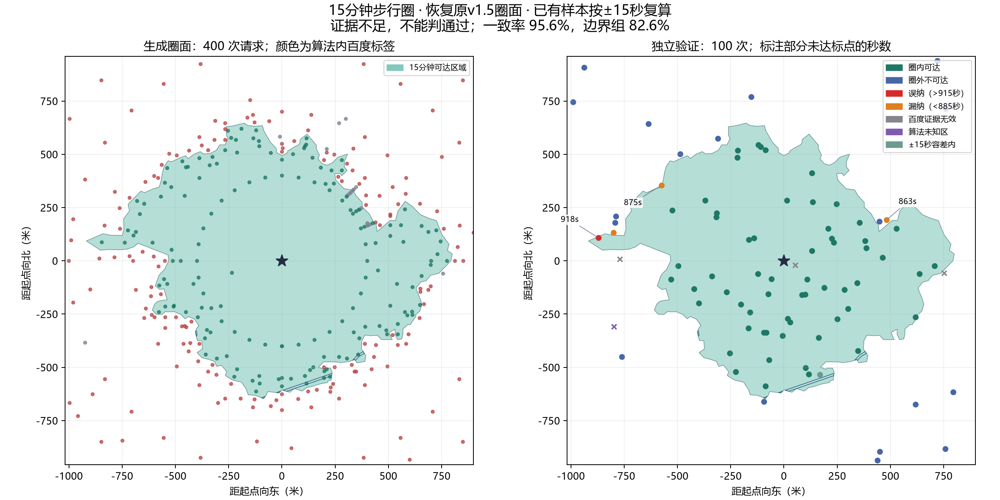

# 回滚核对：恢复原v1.5成圈，验证分配单独调整

**已恢复对话前的成圈核心。此次回滚与核对新增百度调用为0。**

## 为什么上一轮变差

2.4×2.4公里计算范围并没有变。问题是v1.6同时改了生成采样、插值、填充和验收方法，超出了“减少圈外验证、集中边界”的必要改动。

- 生成中的无效端点从原版19个增至90个。对未知缺口的优先细化又消耗了后续额度，普通边段证据不足。
- 原来允许的推断填充被过度收紧；这改变了圈面，而不只是报告配色。
- 之前报告的70.79%混合了边界两侧的空间分类与轮廓直接测时，与原版78.26%的边界分类一致率不是同一指标。不能直接相减，但下表同口径比较也证实了退步。

## 用相同点集、相同指标复核

两版圈面分别放到同一组已有百度点上，统一只看空间纳入。v1.5参考集剔除原本无效／弃判点后91个；v1.6参考集有效99个。没有重新请求百度。

| 固定参考集 | 圈面 | 严格900秒一致率 | ±15秒容差一致率 |
| --- | --- | ---: | ---: |
| v15已有有效点（91个） | v15 | 94.51% | 95.60% |
| v15已有有效点（91个） | v16 | 93.41% | 94.51% |
| v16已有有效点（99个） | v15 | 81.82% | 87.88% |
| v16已有有效点（99个） | v16 | 77.78% | 84.85% |

这是事后同口径对照，不能冒充一次新的独立验收。两版均不得据此宣称全边界误差≤15秒。

## 恢复证据

- 从本地对话前完整快照恢复生成调度、默认参数、成面、连续填充、OSM提示和原有本地约束，以及对应接口和客户端。
- 核对15个成圈／接口／客户端核心文件，与v1.5快照逐字节相同。
- 使用旧生成账本离线重放400次响应，请求坐标及顺序完全一致；重建圈面与旧圈面的对称差面积 **0平方米**。
- 原有2.4×2.4公里计算范围保持不变。没有把“圈外少验证”解释成缩小正方形或重新设计成圈。
- v1.6的500次历史调用、失败报告和源码快照保留，当前成圈不再使用该实验版本。

## 现在保留的调整

- 报告统一可达填色，不显示黄色推断区域或水体专门图例；现成水面仅显示圈内部分，不进行额外探测。
- 严格900秒与报告±15秒容差分开记录，保留原始证据和弃判。空间分类一致率不再掺入轮廓直接测时达标率。
- **只调整独立验证分配，不修改生成策略。** 按几何安排少量内部抽查、最多2个远处圈外哨点，其余优先边界；不再使用固定75／15／5／5配额。
- 对当前恢复圈面的离线预排为 **88边界／5内部推断／5其余内部／2远处圈外**。这是自动分配的预览，尚未发送请求；其他圈面会随推断面积和可用区域调整。

图中100个验证点仍是历史v1.5原始点，用来显示恢复情况；不是新的预排点，图中的400＋100次也都是历史调用。

## 验证与状态

后端355项通过、1项跳过；前端156项通过；类型检查和构建成功。本次没有新增百度调用，没有提交或推送，没有接入设施查询。

旧版严格空间分类总体一致率仍为94.51%，加上报告容差为95.60%；旧版边界组严格78.26%，容差82.61%。恢复旧版是撤销退步，不是宣称原版已达到新的95%边界要求。

本地核对证据：`backend/.tmp/rollback-audit.json`、`rollback-v15-manifest.json`、`rollback-checks.json`。历史运行目录与冻结账本未改写。
