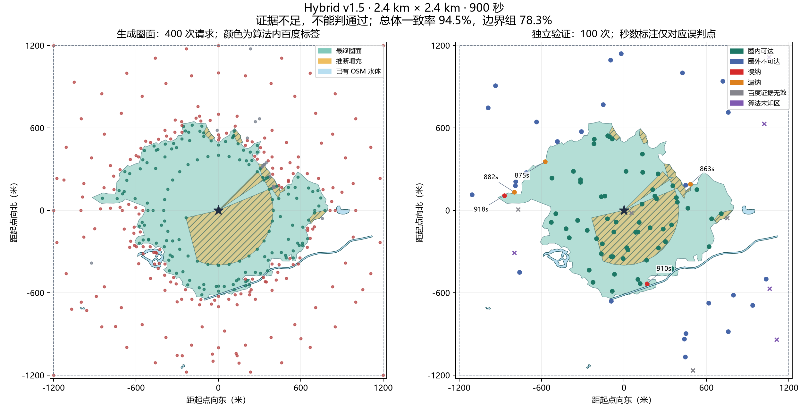

# OSM＋百度 Hybrid v1.5：范围、精度与交付核验

2026-09-16 · 900 秒步行圈 · 唯一起点 BD09LL `(121.51392519758, 31.313079085826)`

**结论：2.4 km × 2.4 km 范围和专用接口已实现，完整真实 API 流程已完成；独立精度证据不足，不能判定通过。**

本轮新增生成请求 **400** 次，独立核验 **100** 次，合计 **500 / 500** 次。无自动重试、未补充其他地点、未在参考标签返回后调整算法重新验收。

生成阶段通过 FastAPI 的 ASGI 接口完成创建、轮询与结果读取，百度请求为真实网络调用；没有接入浏览器页面。首次验证守卫将圈面外未解析水线也视为阻塞。核查确认各项数据可用且该水线不影响最终圈面后，仅对原冻结结果启动尚未执行的 100 次独立验证。原圈面、400 条账本、警告与降级状态均未改写；`blocked.json` 保留为该阶段的历史记录。

## 范围与实际额度

- 实际米制计算域为起点东西、南北各 ±1200 米，面积 5,760,000 m²。不是半径 2.4 km 或半径 1.2 km 的圆。
- 算法账本越界样本 **0**；所有候选以及六位小数的实际请求坐标均先检查范围。越界候选不发送、不计费；四角参与二维支撑采样。
- 最终圈面面积 **1,185,584.15 m²**；相对起点边界 `[西, 南, 东, 北]` 为 `[-918.1, -643.18, 799.69, 646.31]` 米。
- `extent_truncated=false`；质量为 `partial`，停止原因为 `budget_exhausted`，数据就绪模式为 `degraded`。
- 原版 400 点中有 62 点在新范围外，且无有效可达点；旧圈面全部位于新范围。但新采样会重新分配额度，本轮生成相对旧版实际差额是 **0 次**，不能把 62 点直接说成节省 62 次。
- 本轮生成及验证发送时间合并检查，任意半开滑动一秒窗口最多 **3 次**。请求上限仍为生成 400、验证 100；验证不挤占或借用生成预算。

生成标签统计：`{'VALID_REACHABLE': 161, 'VALID_UNREACHABLE': 220, 'INVALID_ENDPOINT_OFFSET': 19}`。原始耗时、偏移超限、失败与未知均留存，不将无效证据改写为可达或不可达。

## 独立精度验收

先冻结 API 结果、配置、算法账本，再以固定种子 `20260916` 选点。四组计划各 25 点；空分层在请求前转入边界组，本轮不适用分层为 `[]`。点坐标与算法请求去重，参考标签未参与成面。边界附近指最终边界两侧 50 米带内的陆地点。

| 分层 | 计划 | 有效可判定 | 百度无效/未返回 | 算法未知 | 一致率 | 误纳 / 漏纳 |
| --- | ---: | ---: | ---: | ---: | ---: | ---: |
| 边界附近 | 25 | 23 | 2 | 0 | 78.26% | 2 / 3 |
| 推断填充 | 25 | 24 | 1 | 0 | 100.00% | 0 / 0 |
| 其余圈内 | 25 | 25 | 0 | 0 | 100.00% | 0 / 0 |
| 圈外 | 25 | 19 | 1 | 5 | 100.00% | 0 / 0 |

- 可判定总数 **91 / 100**，分类一致率 **94.51%**，Wilson 95% 区间 **87.78%–97.63%**。
- 误纳率 **3.23%**，区间 **0.89%–11.02%**；分母为预测圈内且百度证据有效的点。
- 漏纳率 **4.76%**，区间 **1.63%–13.09%**；分母为可判定样本中的百度真实可达点。
- 百度证据未知 **4**，另有百度有效但算法处于未知域 **5**；两者互斥记账，合计未知占比 **9.00%**。
- 通过要求：至少 80 个有效可判定点、各适用分层至少 80% 可判定、真实可达和不可达各至少 20 个、总体一致率至少 90%。本轮判定：**独立精度证据不足，不能判定通过**。
- 未满足条件：exterior 可判定 19 < 20。

**边界组需单独看待：一致率为 78.26%，不能被内部和外围较高的一致率掩盖。** 本轮 5 个误判中 5 个在边界组：2 个误纳点百度耗时为 918、910 秒，3 个漏纳点为 863、875、882 秒；它们距当前边界约 0.83–18.47 米。这是误判点与估计边界的距离，不是独立测出的全边界误差。

这些数字仅描述本地点的分层有效参考点，不能解读为圈面面积准确率或全边界误差保证。较高的一致率也不能抵消大量未知。未测量全边界米制误差；算法返回的 `boundary_error_estimate` 仅是已观察径向夹逼宽度。百度预计耗时是本次参考标准，不等于现场实走时间。

## 填充、水体与性能

- 推断填充面积 `268,096.11 m²`；算法自身新增填充样本统计 `{'reachable': 0, 'unreachable': 0, 'unknown': 10, 'scope': 'algorithm_samples_newly_included_by_fill_not_independent_validation'}`，不是独立参考集。
- 最终面与硬水体重叠 `1.20844e-08 m²`，非障碍内部残留 `0 m²`。
- 有效保留桥通道 `0` 条；影响圈面的未解析水线 `0`。没有实桥样本时，只能声明机制测试通过。
- 硬障碍只覆盖当前 OSM 水体及允许的桥例外，未证明门禁、围墙、铁路等所有现实限制已处理完毕。

| 耗时口径 | 秒 |
| --- | ---: |
| 服务启动路网冷加载（独立于任务） | 448.987 |
| 任务准备，含风险/水体处理 | 152.032 |
| 其中水体索引加载 | 68.786 |
| 百度请求响应区间之和，不含 QPS 间隔 | 23.049 |
| 累计成面重建 | 11.599 |
| 计算阶段，含限流等待与请求 | 184.571 |
| API 任务总耗时，不含服务启动 | 336.828 |

图在进程启动时加载一次；风险与水体空间索引按路径、文件版本和投影缓存。首次冷启动较慢，本轮不能用离线重建速度替代真实响应时间；尚未实测第二个热任务。

## 接口、提交与后续工作

专用 Hybrid 类型、OpenAPI、合成响应样例和独立客户端已经提供。客户端不使用旧网格解析器，支持创建、轮询、读取结果、按任务或客户端请求 ID 取消。任务错误码、数据降级、范围截断、空几何与坐标约定已明确；完整诊断只保存在本地。

隔离目录按当前待提交文件集重建，未复制 `.env`、OSM 数据、账本或 Python 环境，复用了已安装依赖；已断言加载的是隔离源码而非原目录的可编辑安装。结果：后端 **353 通过、1 跳过**，算法包 **96 通过**，前端 **156 通过**，类型检查与构建成功。跳过的是需要显式启用的真实 PBF 重建测试。此次不是在全新系统上重新下载、安装所有依赖。

**工程上具备作为待审阅版本提交的条件；不能标为跨地区精度已验收的稳定产品。** 未执行 Git 提交或远程推送，已有历史删除未扩大。实际提交时需包括新增源码、测试、类型、说明和工具；密钥、原始路网与本地证据继续排除。

现有前端页面未切换；`facilitiesStatus=not_integrated`。本阶段没有实现医疗教育检索，也没有调用设施接口。后续采用固定圈面 → 分类候选检索 → 点面筛选 → 按需步行确证，复用当前 POI 分页、UID 去重和账本；扩大医院/诊所/学校等类别目录，将空间纳入、推断区域与真实路线确证分开。详见 [Hybrid 设计及设施方案](../../HYBRID_ISOCHRONE_DESIGN.md)。

后续优化按本轮证据排序：

1. 将边界组的误纳/漏纳作为下一版调度研究对象，优先验证正负证据交界与狭窄缺口，评估在相同 400 次上限内将这些位置细化至 25 米的收益；不把总体 94.51% 当作边界精度已足够。
2. 圈外组 5 点属于算法未知、1 点百度证据无效，只有 19/25 可判定。优先改进稀疏支撑与道路端点候选，保持未知语义；不能直接把外围未知改成不可达来满足验收。
3. 推断填充组可判定 24 点，其中 24 点可达、0 点误纳，仍是有限样本（误纳率的 95% 区间为 0.00%–13.80%），保留推断标记；后续设施可采用按需入口路线确证。
4. 在新的冻结参考集上重新比较调用量、边界组指标和未知率，再决定是否收紧默认预算。当前不能声称已经节省调用或后续无需大改；本轮不再申请或消耗额外验证额度。

## 追溯

- 本地运行目录：`backend/.hybrid-ledgers/verification-v15/`，任务 `8cc7f25f-5b91-49ac-a5fb-d8f6356389c9`。
- 结果哈希：`c960b6a1ab81ca8e8c8f3278196a6b5b15ea775c98e330f02ce0383659e2e507`。
- 算法账本哈希：`ac946b22cb42b87c63dea0f0e44c2db4dc3b26822abd6abeeb62d6b9e6afa695`。
- `validation-plan.json` 保存冻结点位及分层，`validation-ledger.json` 保存独立请求，`metrics.json` 保存逐点分类。
- 旧报告与图片保留在 `verification-v14/`；当前报告和图片均为新版。

复算指标：`python -m tools.validate_hybrid --summarize --output .hybrid-ledgers/verification-v15`。复绘需安装可选 `requirements-report.txt`，使用 `tools.render_hybrid_validation`。两者均不会新增百度请求。
