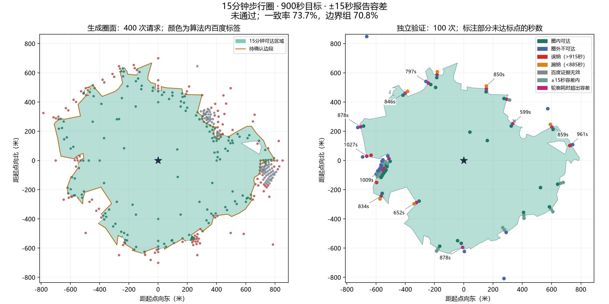

# 15分钟步行圈：边界优化与独立核验

2026-09-16 · hybrid-v1.6.0 · 原起点 BD09LL `(121.513925, 31.313079)`

**结论：未通过边界精度验收。** 边界容差一致率 **70.79%**；轮廓直接测时达标率 **43.33%**；未确认边段比例 **87.88%**。

## 边界与调用

- 生成 **400 / 400** 次，独立验证 **100 / 100** 次；合计 **500 / 500** 次。预算不互借，无自动重试或追加调用。
- 生成阶段：初始定位 35 次、补充探测 20 次、边界工作 345 次；任意半开滑动一秒窗口最多 3 次。
- 边界工作次数按调用目的记账，不等于全部点都在最终边界50米内；本轮后者为 284 点。
- 成圈目标900秒，报告容差±15秒。内部推断与可达面同色；边界缺口须获得新增证据，不能用填充掩盖。
- 未确认时间边界 5407.5 / 6153.0 米。局部目标25米，米制夹逼不能换算成全边界±15秒保证。
- 2.4×2.4公里只作计算上限；`extent_truncated=false`，停止原因 `budget_exhausted`，质量 `partial`。

## 冻结后的独立验证

先冻结结果、配置、账本，再使用种子 `2026091606` 选点。与生成请求去重，实际归一化坐标重检分层。默认75／15／5／5；空分层转给边界，本轮不适用分层为 `['inferred_fill']`；选点缺额为 `{'boundary': 0, 'inferred_fill': 0, 'interior': 0, 'exterior': 0}`。

| 分层 | 计划 | 选中 | 有效 | 容差一致率 | 误纳／漏纳 | 容差内 |
| --- | ---: | ---: | ---: | ---: | ---: | ---: |
| 边界（含轮廓直接测时） | 90 | 90 | 89 | 70.79% | 3 / 6 | 21 |
| 内部推断 | 0 | 0 | 0 | 无有效分母 | 0 / 0 | 0 |
| 其余内部 | 5 | 5 | 5 | 100.00% | 0 / 0 | 0 |
| 远处圈外 | 5 | 5 | 5 | 100.00% | 0 / 0 | 0 |

- 轮廓直接测时：有效 30 / 计划 30，超出容差 17 个；绝对耗时偏差中位数 20.0 秒、最大 301.0 秒。
- 圈内 >915秒才记误纳，圈外 <885秒才记漏纳，885—915秒单列容差内。轮廓点直接要求885—915秒，超出单列“轮廓耗时超出容差”，不重复计入误纳漏纳。
- 严格900秒原始分类：`{'tp': 43, 'tn': 34, 'fn': 13, 'api_unknown': 1, 'fp': 9}`。有效性由原始百度证据决定；无效、未返回不因容差变成有效。
- 验收要求：总量、各适用分层及轮廓组均至少80%有效；边界容差一致率及轮廓直接测时达标率均至少95%；未确认边段≤5%；未截断。
- 未满足条件：边界容差一致率低于95%；轮廓直接测时达标率低于95%；未确认边段累计超过外轮廓长度5%。

圈外分类评估的是最终圈面的空间纳入决定；局部证据支撑状态另存，不能据此宣称所有圈外区域均已探测不可达。未确认比例衡量已有局部交界证据覆盖，独立验证才检查其时间误差。本结果仅描述本地点的分层及配对样本，不代表面积准确率，也不保证全轮廓处处误差≤15秒。

## 与历史运行比较

| 指标 | v1.5历史运行 | 本轮 |
| --- | ---: | ---: |
| 生成调用 | 400 | 400 |
| 生成点中距最终边界≤50米的点 | 211 | 284 |
| 生成点中距最终圈面超过50米的圈外点 | 121 | 72 |
| 独立验证：边界／内部推断／其余内部／远处圈外 | 25／25／25／25 | 90／0／5／5 |
| 边界两侧容差误纳＋漏纳 | 4/23（事后按±15秒重算） | 9/59（另有轮廓测时失败） |
| 未确认边段比例 | 旧版未测量 | 87.88% |

新旧采样分布不同，尤其新版增加轮廓直接测时，不能将两版汇总率当作同分布的精度提升证明。

## 本轮未达标的具体证据

- 生成阶段 90 / 400 个样本未取得有效可达标签；`{'radial_probe': 35, 'topology_proposal': 10, 'independent_2d_exploration': 10, 'opposite_label_bracket': 72, 'boundary_normal_validation': 132, 'open_gap_confirmation': 38, 'unknown_or_sparse_support': 103}` 为调用用途统计。
- 待补充证据的缺口仍有 5 处，未支撑外缘长 610.1 米。未知缺口优先队列消耗了后续细化额度，普通已知正负交界的进一步细化不足；这些位置没有被填充成已确认可达。
- 轮廓直接测时有 17 点超出±15秒，最大偏差 301.0 秒。因此减少圈外采样已做到，精度目标尚未做到，当前结果不宜当作精确的设施纳入边界。
- 下一步应先离线研究无效端点密集区的停止／换点规则及边段间公平分配，避免少数未知缺口耗尽预算。此次保留冻结失败结果，未根据独立验证标签重画圈面或追加请求。

## 检查与性能

- 后端回归：367项通过，1项跳过。
- 算法包回归：96项通过。
- 类型检查与构建：通过。
- 边界专项回归（已包含在后端数量内）：14项通过。
- 前端测试：157项通过。

服务冷启动 72.5 秒；任务准备 0.0 秒；成面重建累计 13.2 秒；计算 167.5 秒；任务合计 167.6 秒。接口完成创建、轮询及结果读取，设施检索仍未接入。

## 追溯

- 本地运行目录：`backend/.hybrid-ledgers/verification-v16/`；任务 `29a7d08a-0472-4d41-9682-63539bb90167`。
- 冻结结果哈希：`074496afbe2889819b9093de07ac256a010eca6c16132ef7b0044647f1d0c401`。
- 生成账本哈希：`66be1fd6f857e4a6f13cfa9082d8f402825ab5244423513682e27bb5e45bd7c5`。
- 原始点位、严格分类、容差分类及逐点秒数保存在 `validation-plan.json`、`validation-ledger.json` 和 `metrics.json`。验证标签未回流成圈；历史运行未改写。
