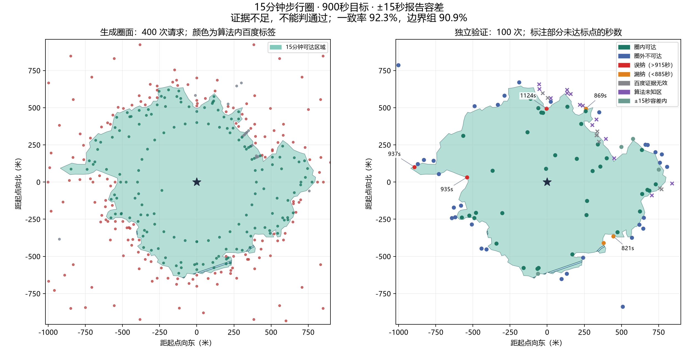

# OSM＋百度新验证策略算法测试报告

2026-09-16 · Hybrid v1.5.0 · 900 秒步行圈 · 固定起点 BD09LL `(121.51392519758, 31.313079085826)`

**结论：本轮不能判定通过，状态为“证据不足”。** 生成与独立验证流程完整执行，500 次真实百度请求均有账本记录；但独立验证仅有 78/100 点可判定，边界组仅 66/88 点可判定，且边界组 ±15 秒容差一致率 90.91%，未达到 95% 要求。

本轮仅测试和生成报告，没有修改成圈算法、验证策略或业务代码，没有自动重试、补点、追加额度、提交或推送。



## 测试对象与口径

- 成圈算法保持恢复后的 Hybrid v1.5：2.4 km × 2.4 km 计算域、900 秒阈值、生成预算 400 次、共享限速 3 QPS。
- 独立验证采用 `hybrid-validation-v3`：内部推断 5 点、其余内部 5 点、远处圈外 2 点，其余 88 点用于边界两侧 50 米带。
- 圈面、配置和生成账本先冻结，再选取验证点；验证标签不参与成圈。
- 严格 900 秒和报告 ±15 秒容差分别统计。885—915 秒内的空间分类差异计为容差内，不改写原始严格分类。
- 本报告统计空间纳入是否一致，不把它解释为全边界误差≤15秒，也不把百度预计耗时当作现场实走真值。

## 调用与运行结果

| 项目 | 结果 |
| --- | ---: |
| 生成请求 | 400 |
| 独立验证请求 | 100 |
| 新增真实请求合计 | 500 / 500 |
| 自动重试 | 0 |
| 半开 1 秒窗口峰值 | 3 次 |
| OSM 冷加载 | 555.753 秒 |
| API 任务总耗时（不含冷加载与独立验证） | 414.515 秒 |
| 生成停止原因 | `budget_exhausted` |
| 计算域截断 | `false` |
| 结果质量 / 数据就绪模式 | `partial` / `degraded` |

生成阶段得到 161 个有效可达、220 个有效不可达和 19 个端点偏移无效样本。独立验证得到 43 个有效可达、49 个有效不可达和 8 个端点偏移无效样本。500 个请求均形成一一对应的事件与样本记录，未发现越过 3 QPS 或预算上限。

质量为 `partial` 的主要原因包括预算耗尽、连续内部含推断填充，以及保留的水线就绪警告。诊断显示影响最终圈壳的未解析水线为 0，计算域未截断，因此工具按预定规则继续验证冻结圈面；这些警告未被删除或改写。

## 独立验证指标

| 分层 | 计划 | 可判定 | 严格 900 秒一致率 | ±15 秒一致率 | 容差误纳 / 漏纳 | 未知 |
| --- | ---: | ---: | ---: | ---: | ---: | ---: |
| 边界两侧 | 88 | 66 | 84.85% | 90.91% | 3 / 3 | 22 |
| 内部推断 | 5 | 5 | 100.00% | 100.00% | 0 / 0 | 0 |
| 其余内部 | 5 | 5 | 100.00% | 100.00% | 0 / 0 | 0 |
| 远处圈外 | 2 | 2 | 100.00% | 100.00% | 0 / 0 | 0 |
| **总体** | **100** | **78** | **87.18%** | **92.31%** | **3 / 3** | **22** |

- 总体容差一致率的 Wilson 95% 区间为 **84.22%–96.43%**；严格一致率区间为 **77.98%–92.88%**。
- 容差后误纳率为 **7.50%**，漏纳率为 **7.14%**。
- 4 个严格误判位于 885—915 秒范围内，报告口径记为容差内；原始严格结果仍保留。
- 22 个未知全部位于边界组：其中 **8 个**为百度端点偏移无效，**14 个**为百度标签有效但算法在该位置没有空间预测。
- 容差后的 6 个误判也全部位于边界组：误纳点百度耗时为 937、935、1124 秒；漏纳点为 869、875、821 秒。它们距估计边界约 2.09–13.82 米，但这只是点到当前圈线的距离，不是全边界误差测量。

## 验收判断

| 要求 | 实测 | 判断 |
| --- | ---: | --- |
| 总可判定点 ≥80 | 78 | 未满足，少 2 点 |
| 各适用分层可判定率 ≥80% | 边界 66/88 = 75.00% | 未满足，边界至少需 71 点，少 5 点 |
| 可达 / 不可达各 ≥20 | 42 / 36 | 满足 |
| 总体容差一致率 ≥90% | 92.31% | 满足 |
| 边界容差一致率 ≥95% | 90.91% | 未满足 |

因此，即使忽略样本有效性不足，边界一致率仍未达到门槛；本轮不能通过。内部三组的 100% 只来自 5、5、2 个点，样本很小，不能用来证明内部或圈外普遍准确。

与历史 v1.5 的 25 点边界组相比，新点集的边界严格一致率为 84.85%（历史 78.26%），容差一致率为 90.91%（历史 82.61%）。两次验证的点集和分配不同，以上仅是描述性对照，不能据此宣称算法精度提升 6.59 或 8.30 个百分点；本轮没有改变成圈算法。

## 几何与 OSM 诊断

- 最终圈面面积：**1,185,584.15 m²**。
- 推断填充面积：**268,096.11 m²**。
- 最终圈面与硬障碍重叠：约 `1.21e-08 m²`；非障碍内部残留：`0 m²`。
- 影响最终圈壳的未解析水线：0；实际保留桥通道：0。
- 未发现范围截断。现有硬障碍主要基于 OSM 水体，不等于门禁、围墙、铁路等现实障碍已全部覆盖。

## 算法判断与后续测试建议

1. 新分配达到了“把额度集中到边界”的目的，但当前边界带与算法支撑域的组合产生了 14 个算法未知点；它首先暴露的是边界证据覆盖不足，而不是百度接口失败。
2. 8 个百度端点偏移无效点应继续弃判，不能改写为可达或不可达。若以后再做新一轮测试，可在选点阶段加入不依赖参考标签的道路端点可用性约束，但这属于策略改动，需另行实现和重新冻结。
3. 边界容差一致率 90.91% 低于 95%，说明即使补足有效点，当前圈面仍没有现成证据满足边界验收线。下一轮应先研究正负证据交界与狭窄缺口的生成细化，再申请新的完整独立验证额度。
4. 本轮额度已用完，不应在同一冻结计划上补点或重试；否则会破坏一次性独立验收口径。

## 工程检查与追溯

- 本轮调用前执行 Hybrid 相关离线测试：**73 项通过**，2 条依赖弃用警告，不影响测试结论。
- 运行目录：`backend/.hybrid-ledgers/verification-v15-restored-20260916/`
- 任务 ID：`f3b126e3-858d-4598-9a20-15d8818abe1a`
- 结果哈希：`e3f565dd95ec8b6b1abb179d6a16428235f88405dad3e5d47020f40006f84ae0`
- 生成账本哈希：`46ab17b96efb49e70057da6b345e1f503e6c04809933ffb5322381f2c36b8cde`
- `validation-plan.json` 保存冻结点位和 88/5/5/2 分配，`validation-ledger.json` 保存独立请求，`metrics.json` 保存逐点严格与容差分类。

离线复算命令不会新增百度请求：

```powershell
.\.venv\Scripts\python.exe -m tools.validate_hybrid --summarize --output .hybrid-ledgers/verification-v15-restored-20260916
```
