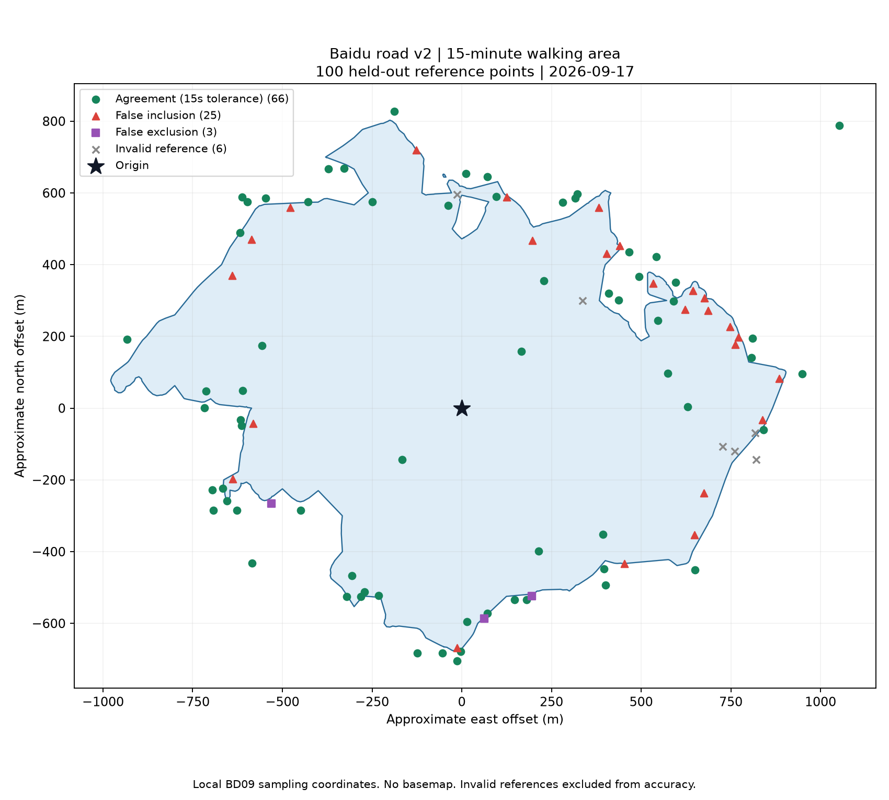

# 百度路网 2.0 真实 API 验证报告

日期：2026-09-17。结论：**未通过**。

固定起点 BD09LL `(121.513925, 31.313079)`；15 分钟（900 秒）步行圈。调用生产成圈方法 `AnalysisManager.compute_baidu_v2`，不包含 HTTP 任务封装、POI 检索或前端验收。

## 真实调用结果

- 算法版本：2.0.0；实际来源：`baidu_route_matrix`。
- 降级原因：`isochrone_permission_unavailable`；质量：`partial`；停止原因：`budget`。
- 生成路线对统计：400；生成网络请求：151；独立核验：100 次；收到响应合计：250。
- 总耗时：186.9 秒；几何有效：True；近似面积：1.457 平方公里。
- 警告：`['endpoints_unverified', 'isochrone_permission_unavailable', 'unfinished_boundary']`。

## 独立精度核验

成圈结果先保存并计算 SHA256，随后固定种子选点，与生成样本去重。边界两侧 50 米带 90 点、内部 8 点、外部 2 点；不使用参考标签修改圈面。参考接口为百度步行路线规划，要求返回端点存在且偏移不超过 50 米。无效点弃判且计入有效率分母；不补点、不重试核验。

| 分层 | 计划 | 有效 | 严格 900 秒一致率 | ±15 秒容差一致率 | 容差误纳 / 漏纳 |
| --- | ---: | ---: | ---: | ---: | ---: | ---: |
| boundary | 90 | 84 | 65.48% | 66.67% | 25 / 3 |
| interior | 8 | 8 | 100.00% | 100.00% | 0 / 0 |
| exterior | 2 | 2 | 100.00% | 100.00% | 0 / 0 |

总体有效 94/100，可达 25、不可达 69；严格一致率 69.15%，容差一致率 70.21%。无效原因：`{'endpoint_offset': 6}`。

参照项目既有门槛：总体至少 80 个有效点，各层至少 80% 有效，可达与不可达各至少 20 点；总体容差一致率至少 90%，边界至少 95%。本轮分层适配 v2 输出，不与旧 Hybrid 结果视为完全同口径对比。885—915 秒内差异仅在容差列豁免，严格列保留。

该结果只代表一个地点的一次空间分类抽样；百度预测耗时并非现场实走真值，不证明整条边界误差 ≤15 秒。路线矩阵生成样本的端点无法由矩阵响应直接验证。

## 证据文件

响应账本共 250 条：原生等时圈 1 条（HTTP 200、百度状态 240），路线矩阵 149 条（148 条状态 0、1 条状态 401），独立路线核验 100 条（全部状态 0）。生成统计中的 `retries=3` 和 `rate_limit=3` 按路线对计数，对应一个三路线对批次的限流，不代表三次 HTTP 限流。

算法记录的生成网络请求数为 151，实际收到的生成响应为 150，存在 1 次计数差异。调度器在调用前累加尝试数，响应账本仅记录收到的响应；现有证据不足以确认该次差异是否已发送至百度，因此不将 251 次算法尝试计数宣称为 251 次已确认网络调用，也不据此推断精确扣费。此统计差异不影响 100 个独立核验点均有响应的结论。

建议优先处理边界误纳：核查路线矩阵端点吸附、稀疏采样插值及未完成边界细化；这些是待排查方向，本轮未证明具体根因。若需验证原生等时圈精度，须先具备对应服务权限。本次未修改生产算法。

同目录保存 `started.json`、`events.jsonl`、`result.json`、`generation-samples.json`、`validation-plan.json`、`validation-results.json`、`summary.json`。响应账本只记录路径和状态，不记录密钥或带密钥 URL。

冻结结果 SHA256：`b3d2ba7ad95996dc890898771691a3535b39079291bae5252b2ee79ec96a9b18`。

## 核验点分布

蓝色为生成圈面；绿色为容差内一致，红色为误纳，紫色为漏纳，灰色为无效参考点。底图未叠加，坐标为局部近似米制偏移。

工程检查：`tests/test_baidu_road_v2.py` 全部 6 项通过（模拟接口测试，与上述真实调用分开计量）。
