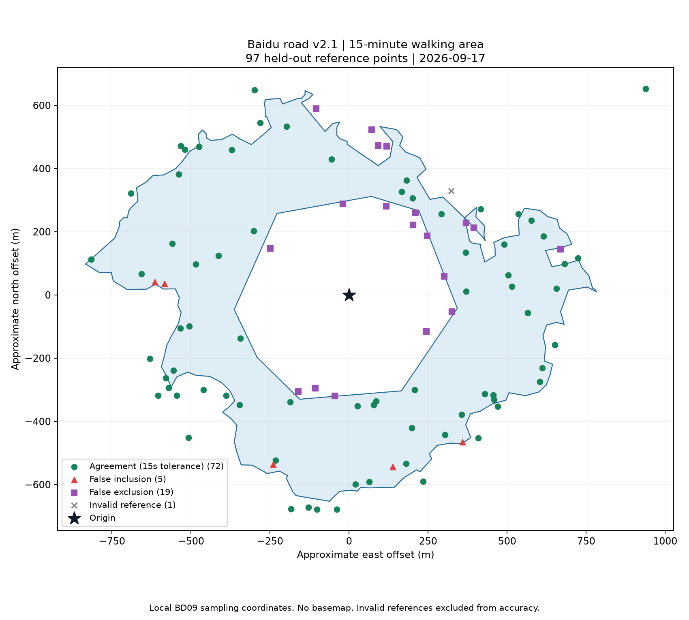

# 百度路网 2.1 调用验证报告

日期：2026-09-17。结论：**调用链路可运行，精度验收未通过**。仅测试和报告，未修改生产算法、配置或前端。

## 范围与方法

固定起点 BD09LL (121.513925, 31.313079)，900 秒步行圈；调用当前生产核心 AnalysisManager.compute_baidu_v2，确认输出版本为 2.1.0。本轮真实测试不含 HTTP 任务封装、POI 和浏览器 UI；这些不能据此宣称通过。相关模拟接口、细化算法和限流回归共 19 项通过，耗时 30.89 秒，另有 2 条依赖弃用警告。

生成预算 400，独立核验总调用 100。原生等时圈 HTTP 200、百度状态 240，降级到 `baidu_route_matrix_refined`。生成耗时 155.61 秒；输出质量 `partial`，停止原因 `refinement_complete`。几何合法，公开圈面近似面积 0.800 平方公里。

## 精度结果

先冻结公开圈面并计算 SHA256，再在其边界两侧 50 米范围等区域按固定种子抽样，与所有生成样本坐标去重。对公开 BD09 圈面转换为局部米制坐标后取点，避免把 2.1 内部投影坐标误当局部偏移。参考为百度详细步行路线，要求端点核验通过。无效点不补测，核验标签不回流修改圈面。

| 分层 | 计划 | 有效 | 严格 900 秒一致率 | ±15 秒容差一致率 | 容差误纳 / 漏纳 |
| --- | ---: | ---: | ---: | ---: | ---: | ---: |
| boundary | 87 | 86 | 67.44% | 72.09% | 5 / 19 |
| interior | 8 | 8 | 100.00% | 100.00% | 0 / 0 |
| exterior | 2 | 2 | 100.00% | 100.00% | 0 / 0 |

正确坐标样本 97 个，有效 96 个，其中可达 67、不可达 29；1 个因端点偏移失效。总体严格一致率 **70.83%**，容差一致率 **75.00%**；边界容差一致率 **72.09%**。样本量达到既有门槛（总有效至少80、各层有效至少80%、可达与不可达各至少20），但未达到总体90%、边界95%的精度门槛。主要错误为边界漏纳19点，误纳5点。

885—915秒差异仅在容差列豁免。边界占绝大多数的分层抽样不是全区域均匀抽样；本轮只代表单地点单次结果，百度预测耗时不是现场实走真值。

## 执行与计数审计

- 生成预算计数400：原生尝试1、矩阵路线对78、详细路线321。实际收到生成HTTP响应324，独立核验响应100，合计424。
- 生成详细路线中14个端点无效；未完成边界18段，长度约779米；未知区约8.049平方公里。生成警告：`['invalid_detailed_endpoints', 'unfinished_boundary', 'unknown_region_preserved']`。
- 原生权限错误收到HTTP响应，但内部账本记为终止，因此生成统计323响应＋1终止与外部424总响应口径不同，不代表少发了一次请求。精确费用不由这些统计推断。
- 首次沙箱测试没有收到网络响应，输出为空，未进行核验；原始记录位于相邻 baidu-v21-live-20260917 目录。其逻辑发送计数不能视为百度已受理次数。
- 本轮测试脚本最初沿用2.0坐标假设，误发3次核验请求，均返回百度状态2。已停止测试进程并保留 invalid-projection-* 原始文件；之后直接读取冻结圈面，使用正确投影完成剩余97次，没有重新成圈。3次错误请求单独披露且不纳入空间精度分母；计入100次核验额度。
- 冻结结果原有 validationStatus 保留 not_independently_validated；本报告的独立验证结论为未通过，未回写结果或修改算法状态。

## 圈面结构检查

公开圈面不包含起点，图中起点落在中央空洞内。这是本轮结果的重要异常：几何合法并不代表生活圈语义完整。中央空洞边缘存在多个独立核验确认的漏纳点。此检查未新增网络调用，也未修补圈面。

## 解释与后续建议

2.1 的真实降级链路已得到验证，但本点位在当前400预算下仍不满足精度门槛。建议后续排查边界漏纳与未知区、无效端点和未完成细化的关系；这些是排查方向，本次未证明具体因果，也未实施修复。

旧2.0报告总体容差70.21%、边界66.67%，本轮为75.00%、72.09%；两轮圈面与采样位置不同，不能据此认定同口径精度提升。

## 证据

同目录 result.json、generation-samples.json、events.jsonl、validation-plan.json、validation-results.json、summary.json、started.json、validation-started.json，以及测试脚本和错误投影记录。圈面SHA256：`f345ab61b0e7fc27d0697a1993e52a2d7ba59bdf77363018754b332653bd4c83`。已复核哈希未变且正确核验点与生成点无坐标重合。账本不保存密钥。

